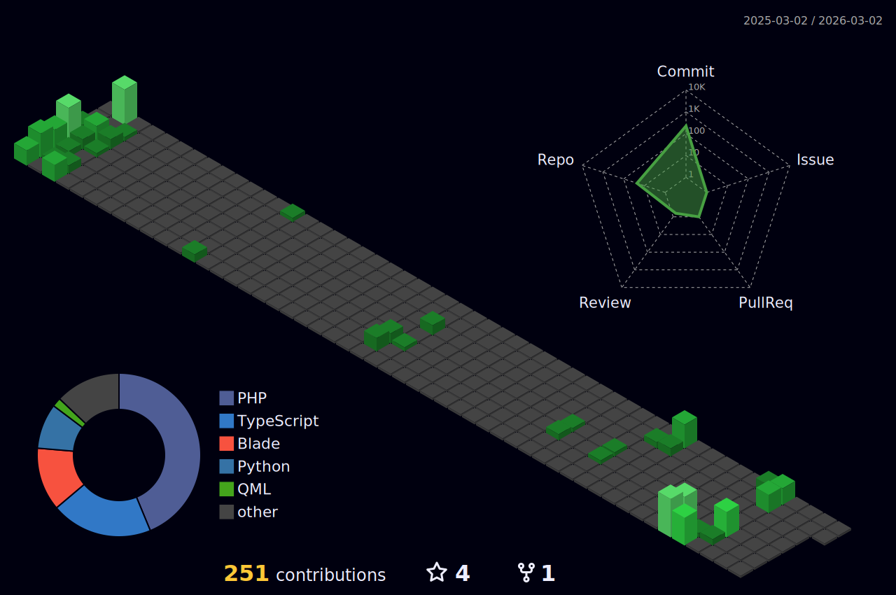

  

  ### 🚀 Senior Full Stack Developer | 🔐 Cybersecurity Specialist | 🤖 AI Enthusiast
  
  

  📍 Based in **Doha, Qatar**

---

### 📖 About Me

I am a seasoned **Senior Full Stack Developer** with over **8 years of experience** in building, maintaining, and optimizing high-performance web applications. My expertise lies in the **PHP (Laravel)** ecosystem, augmented by strong proficiency in **React**, **Vue.js**, and **Python**. 

Currently, I focus on integrating **Cybersecurity** practices into development lifecycles, holding a **BS in Cybersecurity and Digital Forensics** from Kingston University. I am passionate about building secure, scalable, and user-centric systems that solve real-world problems.

- 🔭 I’m currently refining [Adaptive Block Sort](https://github.com/kisalnelaka/Adaptive-Block-Sort) and enterprise integrations.
- 👨‍💻 Explore my work at [kisalnelaka.github.io](https://kisalnelaka.github.io)
- 📝 I share technical insights on [Medium](https://medium.com/@kisalnelaka6)
- 💬 Ask me about **Laravel Architecture**, **Application Security**, or **Scalable Systems**
- 📫 Reach me at: **kisalnelaka6@gmail.com**

---

### 🎯 Core Competencies

  <table>
    <tr>
      <td width="50%">
        <strong>💻 Enterprise Architecture</strong> 
        Scalable backend design, microservices, and system optimization using the Laravel ecosystem.
      </td>
      <td width="50%">
        <strong>🛡️ Cybersecurity & Forensics</strong> 
        Vulnerability assessment, threat detection (OWASP ZAP), and digital forensics analysis.
      </td>
    </tr>
    <tr>
      <td width="50%">
        <strong>🤖 AI & Innovation</strong> 
        Implementing RAG (Retrieval-Augmented Generation) and Python-based automation.
      </td>
      <td width="50%">
        <strong>👥 Leadership & Mentorship</strong> 
        Guided junior teams to deliver high-performance web applications in production.
      </td>
    </tr>
  </table>

---

### 🛠️ Tech Stack & Expertise

#### 💻 Languages & Core

#### 🏗️ Frameworks & Libraries

#### 🗄️ Databases & Infrastructure

#### ⚙️ Productivity & Dev Environment

---

### 🎓 Education & Training

- 🎓 **BSc (Hons) in Cybersecurity and Digital Forensics** – Kingston University, UK
- 📜 **HND in Information Technology** – SLIIT, LK

---

### 🏆 Featured Projects & Organizations

  
  

 

  
  

---

### 💬 Random Dev Quote

  

---

### 📚 Advanced Project & Career Metrics

  

---

### 📊 GitHub Analytics & Productivity

  

 

  
  

---

### 🧱 3D Contribution Visualizer

  

---

### 🌐 Tech Stack Distribution

  

    <strong>Core Ecosystems:</strong> 
    <code>Laravel (PHP)</code> • <code>React/Vue (JS)</code> • <code>AI/Automation (Python)</code> • <code>Mobile (Dart)</code>
  

  

    
  

---

### ✍️ Latest Blog Posts
<!-- BLOG-POST-LIST:START -->
- [Bunny: Revolutionizing Web Development with Laravel](https://medium.com/@kisalnelaka6/bunny-revolutionizing-web-development-with-laravel-12c1f26d14fc?source=rss-3dd06b9e0f4------2)
- [Bunny: The Laravel Scaffolding Package That Makes Web Development a Hop](https://medium.com/@kisalnelaka6/bunny-the-laravel-scaffolding-package-that-makes-web-development-a-hop-7276d4efdf57?source=rss-3dd06b9e0f4------2)
- [JavaScript for Clueless Newbies:Part 1 — Variables, Data Types, &amp; Operators](https://medium.com/@kisalnelaka6/javascript-for-clueless-newbies-part-1-variables-data-types-operators-ae71e4d01ce8?source=rss-3dd06b9e0f4------2)
- [Part 3: Lure Creation — The Art of Deception in Phishing Attacks](https://medium.com/@kisalnelaka6/part-3-lure-creation-the-art-of-deception-in-phishing-attacks-1f677e4eb613?source=rss-3dd06b9e0f4------2)
- [Part 2: The Reconnaissance Phase — Uncovering the Secrets of Phishing Preparation](https://medium.com/@kisalnelaka6/part-2-the-reconnaissance-phase-uncovering-the-secrets-of-phishing-preparation-05f34de00b7b?source=rss-3dd06b9e0f4------2)
- [The Lifecycle of a Phishing Attack: How Cybercriminals Bait, Hook, and Exploit](https://medium.com/@kisalnelaka6/the-lifecycle-of-a-phishing-attack-how-cybercriminals-bait-hook-and-exploit-e05cce7e4f5f?source=rss-3dd06b9e0f4------2)
- [PhishCatcher: Real-Time Phishing Detection with Chrome Extensions and Machine Learning](https://medium.com/@kisalnelaka6/phishcatcher-real-time-phishing-detection-with-chrome-extensions-and-machine-learning-450bf06e78c2?source=rss-3dd06b9e0f4------2)
- [Building a Blockchain-Powered, Encrypted Chat Application with Python](https://medium.com/@kisalnelaka6/building-a-blockchain-powered-encrypted-chat-application-with-python-103f116fad34?source=rss-3dd06b9e0f4------2)
- [Demystifying Shellcode Generation: A Guide for Beginners](https://medium.com/@kisalnelaka6/demystifying-shellcode-generation-a-guide-for-beginners-e8b536599296?source=rss-3dd06b9e0f4------2)
- [Navigating the Dragon’s Lair: A Guide to Metasploit Framework’s Menu in Linux](https://medium.com/@kisalnelaka6/navigating-the-dragons-lair-a-guide-to-metasploit-framework-s-menu-in-linux-33e96954c8cc?source=rss-3dd06b9e0f4------2)
<!-- BLOG-POST-LIST:END -->

---

### 🐍 Contribution Activity

  

---

### 📔 Guestbook

  
Say hello! Click the link below to sign my profile guestbook.

  

<!-- START_SECTION:guestbook -->
<!-- END_SECTION:guestbook -->

---

### 🤝 Connect with Me

  
  
  
  

 

  

