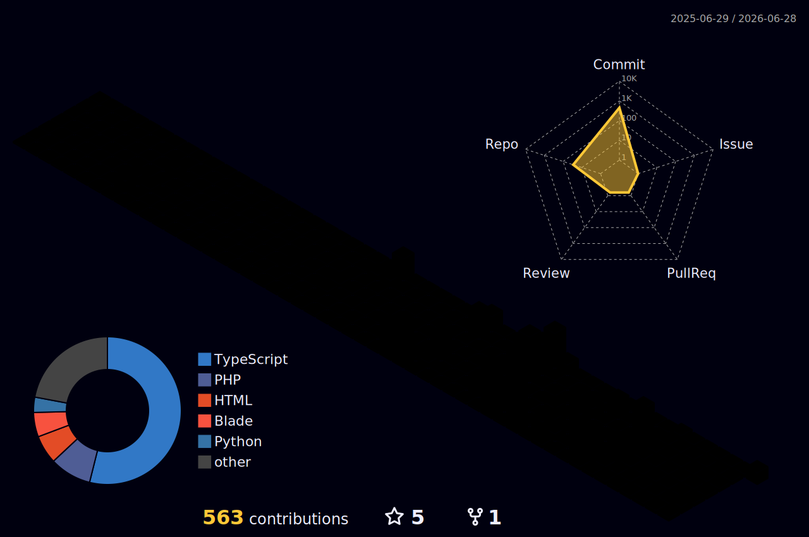

# Kisal Nelaka

<div align="center">
  
</div>

<div align="center">

  [](https://linkedin.com/in/kisalnelaka)
  [](mailto:kisalnelaka6@gmail.com)
  [](https://kisalnelaka.github.io)
  [](https://medium.com/@kisalnelaka6)

</div>

---

## who i am (against my better judgment)

8+ years deep. Systems architecture, offensive security, full-stack engineering. I specialize in building things that *probably shouldn't work as well as they do* — distributed systems, multi-tenant SaaS platforms, decentralized mesh networks, and the occasional tool that makes security professionals uncomfortable.

My relationship with software is a toxic dependency I can't quit. The code works. I'm fine. Don't ask.

Core obsessions: **eliminating architectural overhead**, **strict data isolation**, **non-blocking I/O**, and making PHP do things PHP was never meant to do.

---

<div align="center">
  
</div>

---

## things i actually know

```
Languages       → PHP (8.3+), TypeScript, Python, C#, Kotlin, C++, Rust
Backend         → Laravel Internals, Node.js, Radix Tree Routing, Fibers/Non-blocking I/O
                  Persistent Memory Architectures, WebSockets, Custom TCP/UDP stacks
Frontend        → React, Vue.js, Tailwind CSS, Native JS (performance first, always)
Infrastructure  → Docker, Linux Kernel/PCNTL, CI/CD Automation
Security        → Penetration Testing (OSCP-standard), SIEM (Splunk), Palo Alto Networks
Dark Arts       → Things I've seen in production that I will not document
```

---

## things i made instead of therapy
<!-- SHOWCASE:START -->
#### [NexusFlow ERP](https://github.com/kisalnelaka/nexusflow_erp) | *Multi-tenant SaaS Infrastructure*
*   **Challenge:** Ensuring strict data isolation and high-speed communication in complex multi-tenant environments.
*   **Solution:** Architected a modular ERP system with automated global tenant scoping and high-performance inter-service communication.
*   **Impact:** Guaranteed 100% data isolation while maintaining a seamless user experience across distributed modules.

#### [TheNet](https://github.com/kisalnelaka/thenet) | *Decentralized Mesh Architecture*
*   **Challenge:** Reducing cloud dependency and latency for local file synchronization.
*   **Solution:** Developed a secure, decentralized mesh network using WebSockets and Node.js for real-time peer-to-peer file orchestration.
*   **Impact:** Enabled zero-latency local synchronization with zero reliance on external cloud providers.

<!-- SHOWCASE:END -->

---

## recent repos (the ones i'll admit to)
<!-- RECENT-REPOS:START -->
- [TenancyOS](https://github.com/kisalnelaka/TenancyOS) - A production-ready, multi-tenant Property Management SaaS (TenancyOS) built with Laravel 11 and React. Features automated organization scoping, RBAC, and full audit logging.
- [resu_me](https://github.com/kisalnelaka/resu_me) - Easy resume modifier
- [jeOS](https://github.com/kisalnelaka/jeOS) - just enough
- [nexusflow_erp](https://github.com/kisalnelaka/nexusflow_erp) - Built from the ground up to showcase mastery over modern full-stack development, cloud orchestration, and high-performance inter-service communication.
- [path_setter](https://github.com/kisalnelaka/path_setter) - when youre too lazy to set paths like me
<!-- RECENT-REPOS:END -->

---

## certifications (the paper trail)

- **Palo Alto Networks Cybersecurity Professional** — they gave me a cert. I already knew this.
- **Applied ChatGPT for Cybersecurity** — Infosec, because offense needs to understand the tools
- **Introduction to SIEM (Splunk)** — EDUCBA, logs are just paranoia in structured format

---

## technical writing (for when i have to explain myself)
<!-- BLOG-POST-LIST:START -->
- [AETHER: Building a PHP 8.3 Framework Without the Bloat](https://medium.com/@kisalnelaka6/aether-building-a-php-8-3-framework-without-the-bloat-f0c1a69780ed?source=rss-3dd06b9e0f4------2)
- [Building InfraFlow: A Production-Grade Multi-Tenant MSP Platform with Laravel 11 and Filament v3](https://medium.com/@kisalnelaka6/building-infraflow-a-production-grade-multi-tenant-msp-platform-with-laravel-11-and-filament-v3-b0070a377124?source=rss-3dd06b9e0f4------2)
- [Bunny: Revolutionizing Web Development with Laravel](https://medium.com/@kisalnelaka6/bunny-revolutionizing-web-development-with-laravel-12c1f26d14fc?source=rss-3dd06b9e0f4------2)
- [Bunny: The Laravel Scaffolding Package That Makes Web Development a Hop](https://medium.com/@kisalnelaka6/bunny-the-laravel-scaffolding-package-that-makes-web-development-a-hop-7276d4efdf57?source=rss-3dd06b9e0f4------2)
- [JavaScript for Clueless Newbies:Part 1 — Variables, Data Types, &amp; Operators](https://medium.com/@kisalnelaka6/javascript-for-clueless-newbies-part-1-variables-data-types-operators-ae71e4d01ce8?source=rss-3dd06b9e0f4------2)
- [Part 3: Lure Creation — The Art of Deception in Phishing Attacks](https://medium.com/@kisalnelaka6/part-3-lure-creation-the-art-of-deception-in-phishing-attacks-1f677e4eb613?source=rss-3dd06b9e0f4------2)
- [Part 2: The Reconnaissance Phase — Uncovering the Secrets of Phishing Preparation](https://medium.com/@kisalnelaka6/part-2-the-reconnaissance-phase-uncovering-the-secrets-of-phishing-preparation-05f34de00b7b?source=rss-3dd06b9e0f4------2)
- [The Lifecycle of a Phishing Attack: How Cybercriminals Bait, Hook, and Exploit](https://medium.com/@kisalnelaka6/the-lifecycle-of-a-phishing-attack-how-cybercriminals-bait-hook-and-exploit-e05cce7e4f5f?source=rss-3dd06b9e0f4------2)
- [PhishCatcher: Real-Time Phishing Detection with Chrome Extensions and Machine Learning](https://medium.com/@kisalnelaka6/phishcatcher-real-time-phishing-detection-with-chrome-extensions-and-machine-learning-450bf06e78c2?source=rss-3dd06b9e0f4------2)
- [Building a Blockchain-Powered, Encrypted Chat Application with Python](https://medium.com/@kisalnelaka6/building-a-blockchain-powered-encrypted-chat-application-with-python-103f116fad34?source=rss-3dd06b9e0f4------2)
<!-- BLOG-POST-LIST:END -->

---

<div align="center">
  
  &nbsp;&nbsp;
  
</div>

<br/>

<div align="center">
  
</div>

---

<div align="center">
  <sub>need a systems architect who won't sugarcoat things?</sub>
  <br/>
  <a href="mailto:kisalnelaka6@gmail.com"><b>kisalnelaka6@gmail.com</b></a>
</div>
