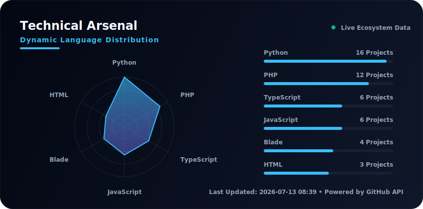

# Kisal Nelaka
### Systems Architect & Full-Stack Engineer
**Specializing in High-Performance Distributed Systems & Secure Architectures**

  
  
  
  

 

  

---

### 🚀 Professional Profile
With over **8 years of experience** in the software industry, I specialize in building scalable, high-performance systems from the ground up. My expertise spans across systems architecture, offensive security, and full-stack development, with a particular focus on eliminating architectural overhead and ensuring robust data isolation.

I am driven by technical excellence and the challenge of architecting systems that are not just functional, but performant and secure by design.

---

### 🛠️ Technical Arsenal

- **Languages**: PHP (8.3+), TypeScript, Python, C#, Kotlin, C++, Rust.
- **Backend & Systems**: Laravel Internals, Node.js, Persistent Memory Architectures, Radix Tree Routing, Non-blocking I/O (Fibers).
- **Frontend**: React, Vue.js, Tailwind CSS, Native JavaScript (Performance-first).
- **Infrastructure & Security**: Docker, Linux Kernel/PCNTL, CI/CD Automation, Penetration Testing (OSCP-standard).

---

### 🏗️ Featured Engineering Showcase
<!-- SHOWCASE:START -->
#### [Aether](https://github.com/kisalnelaka/aether) | *Persistent Memory PHP Framework*
*   **Challenge:** Standard PHP frameworks often suffer from bootstrap overhead and dependency bloat.
*   **Solution:** Built a zero-dependency framework utilizing Radix Tree routing (O(K) complexity) and Fibers for non-blocking I/O.
*   **Impact:** Achieved sub-millisecond boot times by running entirely in persistent memory, eliminating per-request reload overhead.

#### [NexusFlow ERP](https://github.com/kisalnelaka/nexusflow_erp) | *Multi-tenant SaaS Infrastructure*
*   **Challenge:** Ensuring strict data isolation and high-speed communication in complex multi-tenant environments.
*   **Solution:** Architected a modular ERP system with automated global tenant scoping and high-performance inter-service communication.
*   **Impact:** Guaranteed 100% data isolation while maintaining a seamless user experience across distributed modules.

#### [TheNet](https://github.com/kisalnelaka/thenet) | *Decentralized Mesh Architecture*
*   **Challenge:** Reducing cloud dependency and latency for local file synchronization.
*   **Solution:** Developed a secure, decentralized mesh network using WebSockets and Node.js for real-time peer-to-peer file orchestration.
*   **Impact:** Enabled zero-latency local synchronization with zero reliance on external cloud providers.

<!-- SHOWCASE:END -->

---

### 📜 Certifications
*   **Palo Alto Networks Cybersecurity Professional**
*   **Applied ChatGPT for Cybersecurity** (Infosec)
*   **Introduction to SIEM (Splunk)** (EDUCBA)

---

### ✍️ Technical Writing
<!-- BLOG-POST-LIST:START -->
- [AETHER: Building a PHP 8.3 Framework Without the Bloat](https://medium.com/@kisalnelaka6/aether-building-a-php-8-3-framework-without-the-bloat-f0c1a69780ed)
- [Building InfraFlow: A Production-Grade Multi-Tenant MSP Platform with Laravel 11 and Filament v3](https://medium.com/@kisalnelaka6/building-infraflow-a-production-grade-multi-tenant-msp-platform-with-laravel-11-and-filament-v3-b0070a377124)
- [Bunny: Revolutionizing Web Development with Laravel](https://medium.com/@kisalnelaka6/bunny-revolutionizing-web-development-with-laravel-12c1f26d14fc)
- [Bunny: The Laravel Scaffolding Package That Makes Web Development a Hop](https://medium.com/@kisalnelaka6/bunny-the-laravel-scaffolding-package-that-makes-web-development-a-hop-7276d4efdf57)
- [JavaScript for Clueless Newbies:Part 1 — Variables, Data Types, & Operators](https://medium.com/@kisalnelaka6/javascript-for-clueless-newbies-part-1-variables-data-types-operators-ae71e4d01ce8)
<!-- BLOG-POST-LIST:END -->

---

### 📈 Recent Activity
<!-- RECENT-REPOS:START -->
- [aether](https://github.com/kisalnelaka/aether) - A PHP 8.3 framework that doesn't suck.
- [aether-site](https://github.com/kisalnelaka/aether-site) - aether demo site
- [resu_me](https://github.com/kisalnelaka/resu_me) - Easy resume modifier
- [jeOS](https://github.com/kisalnelaka/jeOS) - just enough
- [nexusflow_erp](https://github.com/kisalnelaka/nexusflow_erp) - Built from the ground up to showcase mastery over modern full-stack development, cloud orchestration, and high-performance inter-service communication.
<!-- RECENT-REPOS:END -->

---

  
<i>Looking for a systems architect or senior engineer to solve complex technical challenges? Let's connect.</i>

  <a href="mailto:kisalnelaka6@gmail.com"><b>Get in Touch</b></a>

