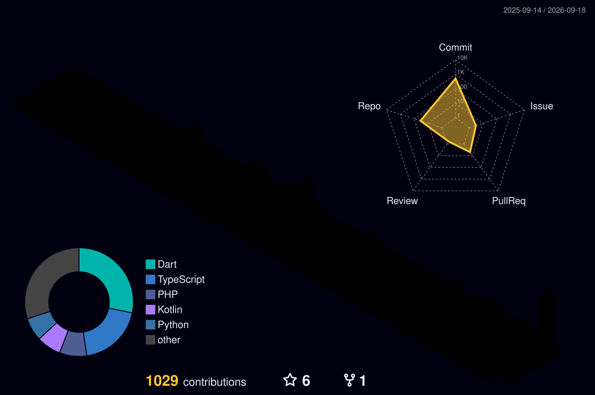

# Kisal Nelaka

**Senior Full-Stack Engineer & Systems Architect**  
*9+ years shipping high-throughput multi-tenant SaaS, distributed architectures, zero-dependency frameworks, and security tooling.*

[LinkedIn](https://linkedin.com/in/kisalnelaka) · [Portfolio](https://kisalnelaka.github.io) · [Medium](https://medium.com/@kisalnelaka6) · [Email](mailto:kisalnelaka6@gmail.com)

---

  

---

### Technical Expertise

- **Backend & Core Systems:** PHP 8.3 / Laravel 11, Node.js, Python, REST & GraphQL APIs, Custom Micro-Frameworks
- **Frontend & Interfaces:** React 18, TypeScript, Tailwind CSS, Vite, Modern Web Architecture
- **Data & In-Memory:** PostgreSQL, MySQL, Redis (Queues & Pub/Sub), Eloquent ORM
- **Infrastructure & Automation:** Linux (Kernel/CLI), Docker / Containers, GitHub Actions CI/CD, Nginx
- **Architecture & Security:** Multi-Tenant Isolation, P2P WebSocket Networks, Penetration Testing & Threat Analysis

---

### Technical Writing & Research

<!-- BLOG-POST-LIST:START -->
- [Bypassing the “Mac Tax”: How I Built an Engine to Develop, Sign, and Deploy iOS Apps on Linux](https://medium.com/@kisalnelaka6/bypassing-the-mac-tax-how-i-built-an-engine-to-develop-sign-and-deploy-ios-apps-on-linux-d23402944ce7)
- [AETHER: Building a PHP 8.3 Framework Without the Bloat](https://medium.com/@kisalnelaka6/aether-building-a-php-8-3-framework-without-the-bloat-f0c1a69780ed)
- [Building InfraFlow: A Production-Grade Multi-Tenant MSP Platform with Laravel 11 and Filament v3](https://medium.com/@kisalnelaka6/building-infraflow-a-production-grade-multi-tenant-msp-platform-with-laravel-11-and-filament-v3-b0070a377124)
- [Bunny: Revolutionizing Web Development with Laravel](https://medium.com/@kisalnelaka6/bunny-revolutionizing-web-development-with-laravel-12c1f26d14fc)
<!-- BLOG-POST-LIST:END -->

---

### Recent Active Repositories

<!-- RECENT-REPOS:START -->
- [LibreSwift](https://github.com/kisalnelaka/LibreSwift) - Native iOS Swift development on Linux & WSL. No macOS or Xcode required. Build, cross-compile, code-sign, deploy over USB, and interactively debug via LLDB directly inside VS Code. Powered by xtool, rcodesign, libimobiledevice, and SourceKit-LSP.
- [loghorizon.online](https://github.com/kisalnelaka/loghorizon.online) - main Website for loghorizon.online
- [Eldertale](https://github.com/kisalnelaka/Eldertale) - simple game
- [ani-cli](https://github.com/kisalnelaka/ani-cli) - A cli tool to browse and play anime
- [TenancyOS](https://github.com/kisalnelaka/TenancyOS) - A production-ready, multi-tenant Property Management SaaS (TenancyOS) built with Laravel 11 and React. Features automated organization scoping, RBAC, and full audit logging.
<!-- RECENT-REPOS:END -->

---

### Open Source Contributions

<!-- CONTRIBUTIONS:START -->
- [pystardust/ani-cli](https://github.com/pystardust/ani-cli) — [feat: add interactive home dashboard, fzf preview engine, and thumbnail support](https://github.com/pystardust/ani-cli/pull/1874) `(🟢 closed)`
<!-- CONTRIBUTIONS:END -->
