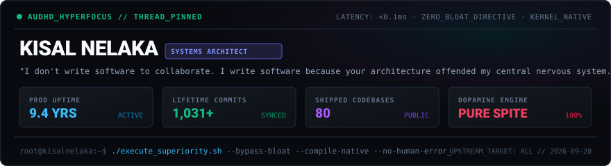
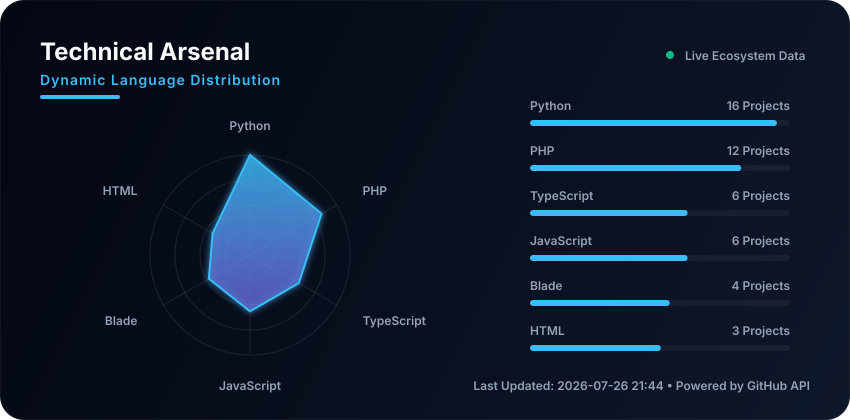

<div align="center">
  
</div>

<br/>

```
$ whoami
kisal nelaka. systems architect, full-stack engineer, security researcher.
8+ years deep. still not bored. that's probably a problem.

$ cat /etc/philosophy
eliminate overhead. enforce isolation. never block the main thread.
build things that work suspiciously well and require no explanation.

$ ls -la interests/
distributed systems        multi-tenant SaaS          mesh networking
offensive security         PHP internals (don't ask)  non-blocking I/O
persistent memory arch     custom TCP/UDP stacks       dark arts
```

---

## `[01] active systems`
<!-- SHOWCASE:START -->
#### [NexusFlow ERP](https://github.com/kisalnelaka/nexusflow_erp) | *Multi-tenant SaaS Infrastructure*

Built a modular ERP with automated global tenant scoping. The kind that just works without you having to think about it. 100% data isolation, zero leakage, seamless UX across distributed modules.

#### [TheNet](https://github.com/kisalnelaka/thenet) | *Decentralized Mesh Architecture*

Cloud dependency is a crutch. Built a secure, decentralized mesh network over WebSockets and Node.js. Peer-to-peer file orchestration, zero cloud involvement, zero-latency local sync.

<!-- SHOWCASE:END -->

---

## `[02] recent repos`

<!-- RECENT-REPOS:START -->
- [TenancyOS](https://github.com/kisalnelaka/TenancyOS) - production-ready multi-tenant property management SaaS. Laravel 11, React, RBAC, full audit logging.
- [al-sharq-assesment](https://github.com/kisalnelaka/al-sharq-assesment) - small but production-minded content management app
- [resu_me](https://github.com/kisalnelaka/resu_me) - easy resume modifier
- [jeOS](https://github.com/kisalnelaka/jeOS) - just enough OS. nothing more.
- [nexusflow_erp](https://github.com/kisalnelaka/nexusflow_erp) - full-stack ERP built from scratch. multi-tenant. it haunts me.
<!-- RECENT-REPOS:END -->

---

## `[03] stack`

<div align="center">
  
</div>

```
Languages     PHP 8.3+  TypeScript  Python  C#  Kotlin  C++  Rust
Backend       Laravel internals · Node.js · Radix tree routing
              Fibers / non-blocking I/O · WebSockets · custom TCP/UDP
Frontend      React · Vue.js · Tailwind · Native JS (perf first, always)
Infra         Docker · Linux kernel / PCNTL · CI/CD automation
Security      Penetration testing (OSCP-standard) · SIEM (Splunk)
              Palo Alto Networks · things I've seen in prod that I won't document
```

---

## `[04] writing`

<!-- BLOG-POST-LIST:START -->
- [AETHER: Building a PHP 8.3 Framework Without the Bloat](https://medium.com/@kisalnelaka6/aether-building-a-php-8-3-framework-without-the-bloat-f0c1a69780ed?source=rss-3dd06b9e0f4------2)
- [Building InfraFlow: A Production-Grade Multi-Tenant MSP Platform with Laravel 11 and Filament v3](https://medium.com/@kisalnelaka6/building-infraflow-a-production-grade-multi-tenant-msp-platform-with-laravel-11-and-filament-v3-b0070a377124?source=rss-3dd06b9e0f4------2)
- [Bunny: Revolutionizing Web Development with Laravel](https://medium.com/@kisalnelaka6/bunny-revolutionizing-web-development-with-laravel-12c1f26d14fc?source=rss-3dd06b9e0f4------2)
- [Bunny: The Laravel Scaffolding Package That Makes Web Development a Hop](https://medium.com/@kisalnelaka6/bunny-the-laravel-scaffolding-package-that-makes-web-development-a-hop-7276d4efdf57?source=rss-3dd06b9e0f4------2)
- [JavaScript for Clueless Newbies: Part 1 - Variables, Data Types & Operators](https://medium.com/@kisalnelaka6/javascript-for-clueless-newbies-part-1-variables-data-types-operators-ae71e4d01ce8?source=rss-3dd06b9e0f4------2)
- [Part 3: Lure Creation - The Art of Deception in Phishing Attacks](https://medium.com/@kisalnelaka6/part-3-lure-creation-the-art-of-deception-in-phishing-attacks-1f677e4eb613?source=rss-3dd06b9e0f4------2)
- [Part 2: The Reconnaissance Phase - Uncovering the Secrets of Phishing Preparation](https://medium.com/@kisalnelaka6/part-2-the-reconnaissance-phase-uncovering-the-secrets-of-phishing-preparation-05f34de00b7b?source=rss-3dd06b9e0f4------2)
- [The Lifecycle of a Phishing Attack: How Cybercriminals Bait, Hook, and Exploit](https://medium.com/@kisalnelaka6/the-lifecycle-of-a-phishing-attack-how-cybercriminals-bait-hook-and-exploit-e05cce7e4f5f?source=rss-3dd06b9e0f4------2)
- [PhishCatcher: Real-Time Phishing Detection with Chrome Extensions and Machine Learning](https://medium.com/@kisalnelaka6/phishcatcher-real-time-phishing-detection-with-chrome-extensions-and-machine-learning-450bf06e78c2?source=rss-3dd06b9e0f4------2)
- [Building a Blockchain-Powered, Encrypted Chat Application with Python](https://medium.com/@kisalnelaka6/building-a-blockchain-powered-encrypted-chat-application-with-python-103f116fad34?source=rss-3dd06b9e0f4------2)
<!-- BLOG-POST-LIST:END -->

---

## `[05] paper trail`

```
Palo Alto Networks Cybersecurity Professional   they gave me a cert. I already knew this.
Applied ChatGPT for Cybersecurity               Infosec, because offense needs the tools
Introduction to SIEM (Splunk)                   logs are just paranoia in structured format
```

---

```
$ ping kisalnelaka
need a systems architect who won't sugarcoat things?
  kisalnelaka6@gmail.com
  linkedin.com/in/kisalnelaka
  medium.com/@kisalnelaka6
```
