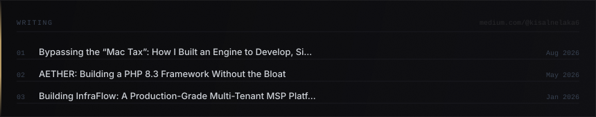

  

[LinkedIn](https://linkedin.com/in/kisalnelaka) &nbsp;&middot;&nbsp; [Portfolio](https://kisalnelaka.github.io) &nbsp;&middot;&nbsp; [Email](mailto:kisalnelaka6@gmail.com) &nbsp;&middot;&nbsp; [Medium](https://medium.com/@kisalnelaka6)

 

  

  

  

  

All repos &amp; articles

 

**Recent work**

<!-- RECENT-REPOS:START -->
- [LibreSwift](https://github.com/kisalnelaka/LibreSwift) - iOS Development in linux
- [TenancyOS](https://github.com/kisalnelaka/TenancyOS) - A production-ready, multi-tenant Property Management SaaS (TenancyOS) built with Laravel 11 and React. Features automated organization scoping, RBAC, and full audit logging.
- [al-sharq-assesment](https://github.com/kisalnelaka/al-sharq-assesment) - small but production-minded content-management application
- [resu_me](https://github.com/kisalnelaka/resu_me) - Easy resume modifier
- [jeOS](https://github.com/kisalnelaka/jeOS) - just enough
<!-- RECENT-REPOS:END -->

**All articles**

<!-- BLOG-POST-LIST:START -->
- [AETHER: Building a PHP 8.3 Framework Without the Bloat](https://medium.com/@kisalnelaka6/aether-building-a-php-8-3-framework-without-the-bloat-f0c1a69780ed)
- [Building InfraFlow: A Production-Grade Multi-Tenant MSP Platform with Laravel 11 and Filament v3](https://medium.com/@kisalnelaka6/building-infraflow-a-production-grade-multi-tenant-msp-platform-with-laravel-11-and-filament-v3-b0070a377124)
- [Bunny: Revolutionizing Web Development with Laravel](https://medium.com/@kisalnelaka6/bunny-revolutionizing-web-development-with-laravel-12c1f26d14fc)
- [Bunny: The Laravel Scaffolding Package That Makes Web Development a Hop](https://medium.com/@kisalnelaka6/bunny-the-laravel-scaffolding-package-that-makes-web-development-a-hop-7276d4efdf57)
<!-- BLOG-POST-LIST:END -->

