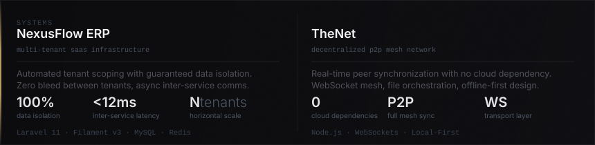

<div align="center">

[](https://github.com/kisalnelaka)

</div>

<div align="center">
  
</div>

<div align="center">

[linkedin](https://linkedin.com/in/kisalnelaka) &nbsp;·&nbsp; [portfolio](https://kisalnelaka.github.io) &nbsp;·&nbsp; [medium](https://medium.com/@kisalnelaka6) &nbsp;·&nbsp; [email](mailto:kisalnelaka6@gmail.com) &nbsp;·&nbsp; 

</div>

---

```bash
$ cat /proc/kisal/status

Name:        Kisal Nelaka
State:       R (running) — always
Uptime:      9.3 years
Threads:     too many open tabs
Stack:       PHP · Laravel · React · TypeScript · Node.js · Python · Redis · Linux
SigCatch:    SIGSEGV (push to prod anyway)
Warning:     will rewrite the framework instead of using it
             will refactor at 2AM when it was working fine
             will add one more feature before shipping
```

---

<div align="center">


</div>

<div align="center">

[](https://github.com/kisalnelaka)

</div>

---

## `> ls -la ./what-i-build`

```
drwxr-xr-x  micro-frameworks/      zero-dep PHP internals · because bloat is a choice
drwxr-xr-x  multi-tenant-saas/     hard tenant scoping · 100% data isolation · non-negotiable
drwxr-xr-x  agentic-workflows/     local LLMs · offline · doing real work while I sleep
drwxr-xr-x  mesh-networks/         P2P over WebSockets · no cloud middlemen · no SLAs
drwxr-xr-x  security-tooling/      pen testing · SIEM · things I can't talk about on GitHub
-rw-------  /dev/null              2AM ideas that "have potential"
```

---

## `> ./featured --systems`

<div align="center">
  
</div>

<div align="center">
  
</div>

---

## `> chess --interactive`

> It's a live game. Click a move → opens an issue → bot plays → board updates.
> You won't win. But you're welcome to try.

<!-- CHESS:START -->
```
  Move #1  White to move
  a  b  c  d  e  f  g  h
  ───────────────────────
8│ ♜  ♞  ♝  ♛  ♚  ♝  ♞  ♜ │8
7│ ♟  ♟  ♟  ♟  ♟  ♟  ♟  ♟ │7
6│                         │6
5│                         │5
4│                         │4
3│                         │3
2│ ♙  ♙  ♙  ♙  ♙  ♙  ♙  ♙ │2
1│ ♖  ♘  ♗  ♕  ♔  ♗  ♘  ♖ │1
  ───────────────────────
  a  b  c  d  e  f  g  h
```

**White to move.** Click a move:

[`a2a3`](https://github.com/kisalnelaka/kisalnelaka/issues/new?title=chess:+a2a3&labels=chess) [`a2a4`](https://github.com/kisalnelaka/kisalnelaka/issues/new?title=chess:+a2a4&labels=chess) [`b2b3`](https://github.com/kisalnelaka/kisalnelaka/issues/new?title=chess:+b2b3&labels=chess) [`b2b4`](https://github.com/kisalnelaka/kisalnelaka/issues/new?title=chess:+b2b4&labels=chess) [`c2c3`](https://github.com/kisalnelaka/kisalnelaka/issues/new?title=chess:+c2c3&labels=chess) [`c2c4`](https://github.com/kisalnelaka/kisalnelaka/issues/new?title=chess:+c2c4&labels=chess) [`d2d3`](https://github.com/kisalnelaka/kisalnelaka/issues/new?title=chess:+d2d3&labels=chess) [`d2d4`](https://github.com/kisalnelaka/kisalnelaka/issues/new?title=chess:+d2d4&labels=chess) [`e2e3`](https://github.com/kisalnelaka/kisalnelaka/issues/new?title=chess:+e2e3&labels=chess) [`e2e4`](https://github.com/kisalnelaka/kisalnelaka/issues/new?title=chess:+e2e4&labels=chess) [`f2f3`](https://github.com/kisalnelaka/kisalnelaka/issues/new?title=chess:+f2f3&labels=chess) [`f2f4`](https://github.com/kisalnelaka/kisalnelaka/issues/new?title=chess:+f2f4&labels=chess) [`g2g3`](https://github.com/kisalnelaka/kisalnelaka/issues/new?title=chess:+g2g3&labels=chess) [`g2g4`](https://github.com/kisalnelaka/kisalnelaka/issues/new?title=chess:+g2g4&labels=chess) [`h2h3`](https://github.com/kisalnelaka/kisalnelaka/issues/new?title=chess:+h2h3&labels=chess) [`h2h4`](https://github.com/kisalnelaka/kisalnelaka/issues/new?title=chess:+h2h4&labels=chess) [`b1a3`](https://github.com/kisalnelaka/kisalnelaka/issues/new?title=chess:+b1a3&labels=chess) [`b1c3`](https://github.com/kisalnelaka/kisalnelaka/issues/new?title=chess:+b1c3&labels=chess) [`g1f3`](https://github.com/kisalnelaka/kisalnelaka/issues/new?title=chess:+g1f3&labels=chess) [`g1h3`](https://github.com/kisalnelaka/kisalnelaka/issues/new?title=chess:+g1h3&labels=chess)

<sub>FEN: `rnbqkbnr/pppppppp/8/8/8/8/PPPPPPPP/RNBQKBNR w KQkq - 0 1`</sub>
<!-- CHESS:END -->

---

## `> tail -f /var/log/writing`

<!-- BLOG-POST-LIST:START -->
- [AETHER: Building a PHP 8.3 Framework Without the Bloat](https://medium.com/@kisalnelaka6/aether-building-a-php-8-3-framework-without-the-bloat-f0c1a69780ed)
- [Building InfraFlow: A Production-Grade Multi-Tenant MSP Platform with Laravel 11 and Filament v3](https://medium.com/@kisalnelaka6/building-infraflow-a-production-grade-multi-tenant-msp-platform-with-laravel-11-and-filament-v3-b0070a377124)
- [Bunny: Revolutionizing Web Development with Laravel](https://medium.com/@kisalnelaka6/bunny-revolutionizing-web-development-with-laravel-12c1f26d14fc)
- [Bunny: The Laravel Scaffolding Package That Makes Web Development a Hop](https://medium.com/@kisalnelaka6/bunny-the-laravel-scaffolding-package-that-makes-web-development-a-hop-7276d4efdf57)
- [Part 3: Lure Creation - The Art of Deception in Phishing Attacks](https://medium.com/@kisalnelaka6/part-3-lure-creation-the-art-of-deception-in-phishing-attacks-1f677e4eb613)
<!-- BLOG-POST-LIST:END -->

---

<div align="center">

[](https://github.com/kisalnelaka)

</div>

<div align="center">

[](https://github.com/ryo-ma/github-profile-trophy)

</div>

<div align="center">
  
</div>

---

<details>
<summary><code>open source contributions</code></summary>
<br/>

<!-- CONTRIBUTIONS:START -->
- *Actively contributing to open source ecosystems across Laravel, PHP core tooling, and decentralized networks.*
<!-- CONTRIBUTIONS:END -->

</details>

<details>
<summary><code>recent repos</code></summary>
<br/>

<!-- RECENT-REPOS:START -->
- [TenancyOS](https://github.com/kisalnelaka/TenancyOS) - Production-ready multi-tenant property management SaaS with Laravel 11, React, RBAC, and automated scoping.
- [al-sharq-assesment](https://github.com/kisalnelaka/al-sharq-assesment) - Production-focused content management application.
- [resu_me](https://github.com/kisalnelaka/resu_me) - Streamlined resume customization tool.
- [jeOS](https://github.com/kisalnelaka/jeOS) - Lightweight OS kernel environment.
- [nexusflow_erp](https://github.com/kisalnelaka/nexusflow_erp) - Full-stack multi-tenant ERP platform.
<!-- RECENT-REPOS:END -->

</details>

---

<div align="center">

```
running on espresso · shipping on spite · sleeping when dead
```

</div>
